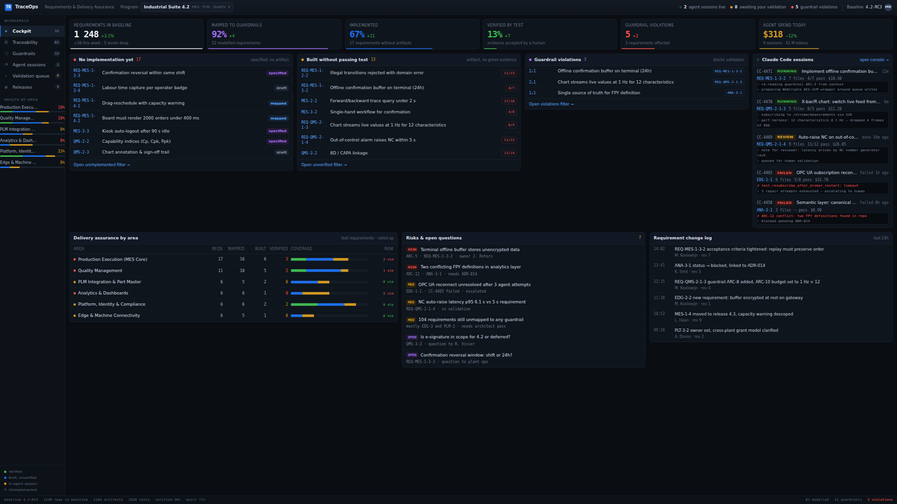
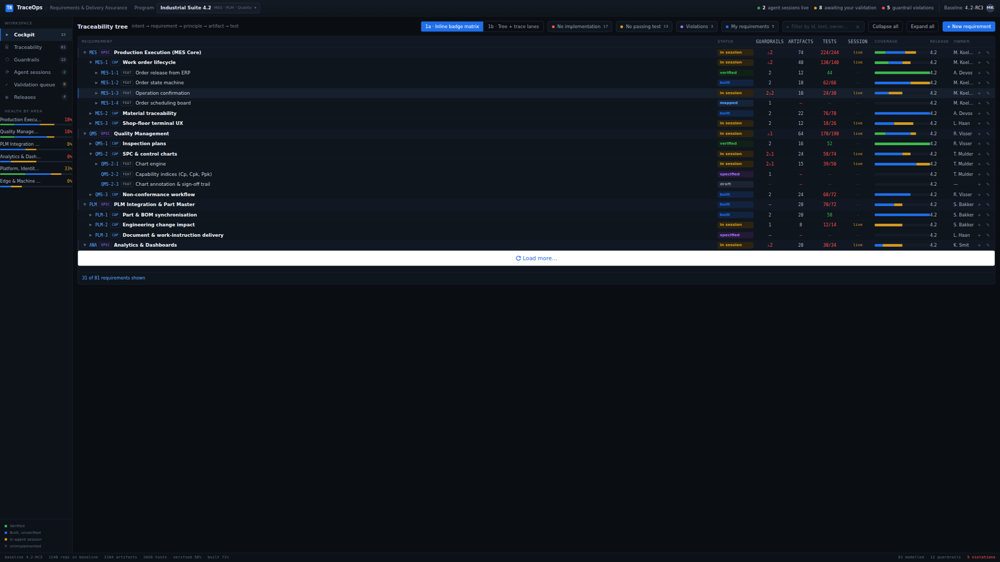
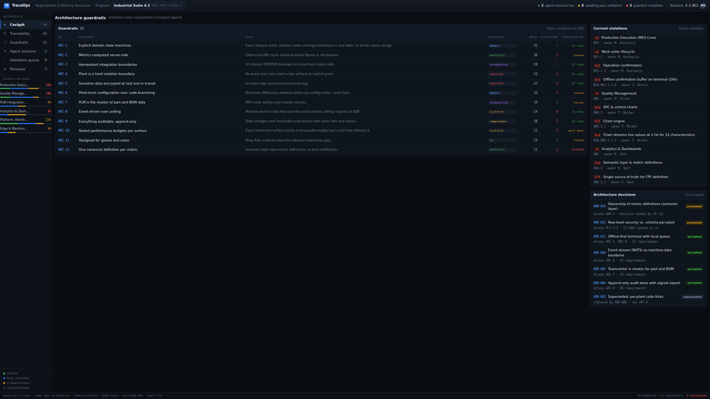
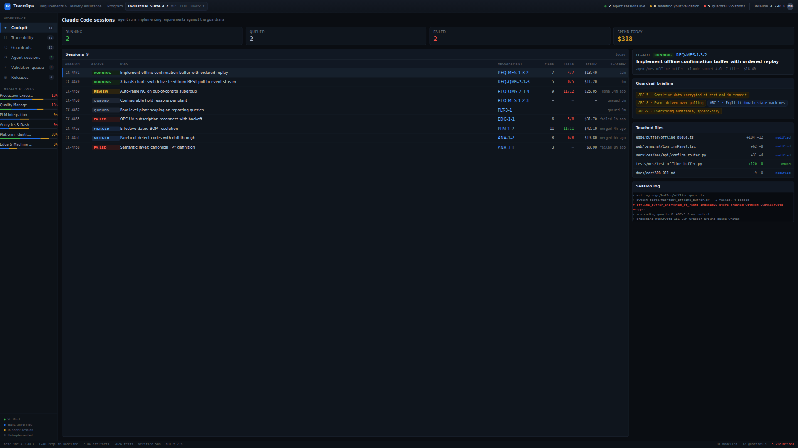
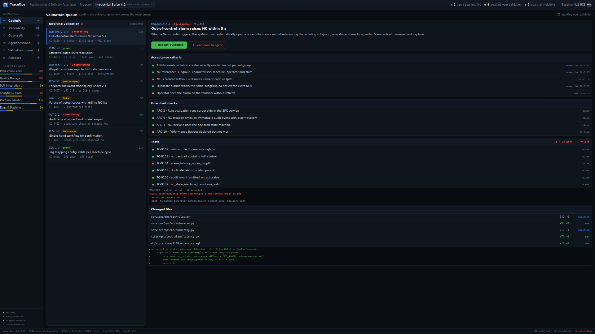
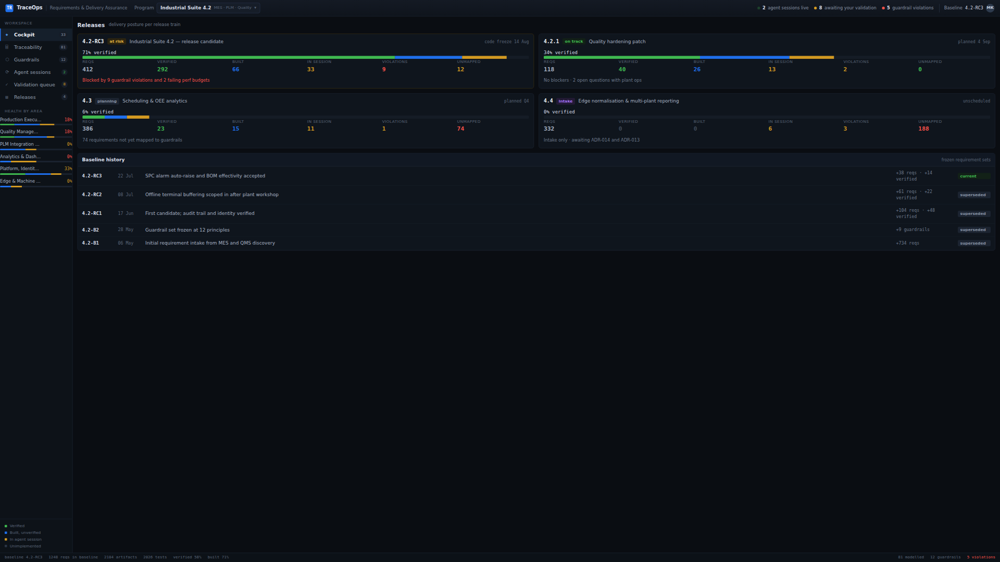
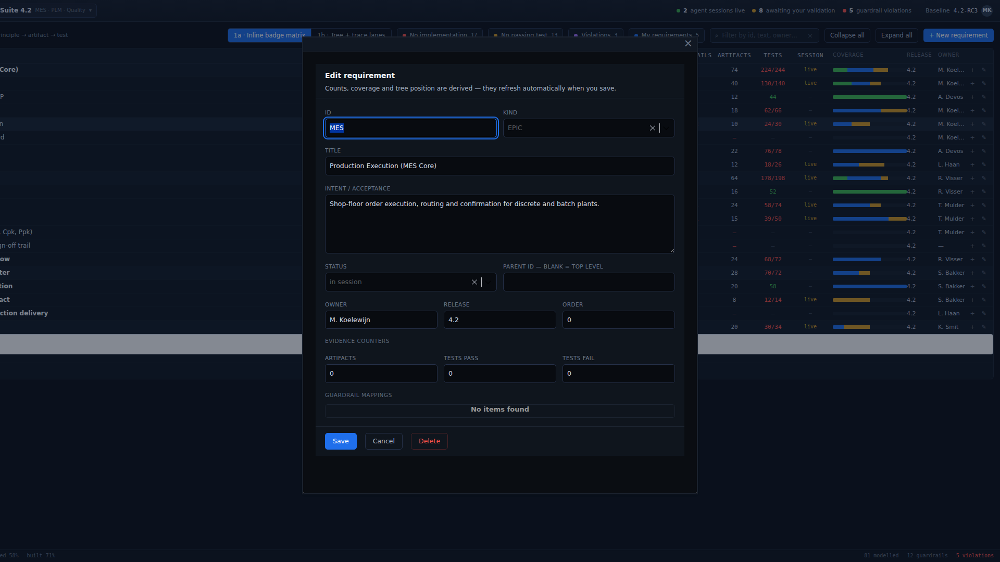

# TraceOps — Requirements & Delivery Assurance

A Mendix 11.12.1 application that reproduces the **Requirements Delivery Tracker**
design prototype: a dense, dark cockpit for tracking requirements from intent all
the way to verified evidence — `intent → requirement → guardrail → artifact → test`
— alongside the AI agent sessions implementing them.

Everything here is authored through **[mxcli](https://github.com/ako/mxcli) and MDL**.
The `.mpr` is never hand-edited and Studio Pro is never opened: the app is defined
by the `.mdl` files in [`TraceOps/mdlsource/`](TraceOps/mdlsource/) and can be
re-applied from scratch.

---

## The app

### Cockpit

Six KPI tiles over three delivery-gap columns — requirements with no
implementation, built-but-unverified, and guardrail violations — plus the live
agent console, per-area assurance rollups, open risks and the requirement change
log.



### Traceability tree

The hero view. An 81-node requirement tree (epic → capability → feature →
requirement) rendered as a nine-column grid: status, guardrail mappings,
artifacts, tests, live session, coverage, release and owner. Rows expand and
collapse, and the filter chips narrow the tree to the gaps that matter.



### Guardrails

The twelve architecture principles every requirement is mapped against, with
their mapping counts and how each is enforced, the violations currently blocking
validation, and the ADRs that drive them.



### Agent sessions

Master/detail over the Claude Code sessions doing the work: what each was
briefed on, which guardrails are at risk, the files it touched, and its streaming
log with pass/fail lines coloured inline.



### Validation queue

The human gate. For each item awaiting sign-off: the acceptance criteria and
whether each is proven, the guardrail checks, the test results with the failing
run's log, the changed files and a diff snippet.



### Releases

Delivery posture per release train — verified/built/in-session split, the stat
row, and what is blocking each one — over the frozen baseline history.



---

## Quick start

The container is ephemeral, so the toolchain is rebuilt from
[`scripts/setup-tools.sh`](scripts/setup-tools.sh) (wired to a `SessionStart`
hook). It is idempotent — a warm run takes about a second.

```bash
bash scripts/setup-tools.sh          # mxcli, ANTLR 4.13.1, mxbuild + runtime 11.12.1

cd TraceOps
./mxcli run --local -p TraceOps.mpr --ensure-db      # → http://127.0.0.1:8080
```

Demo data seeds itself on first start (`ACT_Startup`, guarded to run once).

To rebuild the model from the MDL sources:

```bash
cd TraceOps
for f in mdlsource/*.mdl; do ./mxcli exec "$f" -p TraceOps.mpr; done
~/.mxcli/mxbuild/11.12.1/modeler/mx check TraceOps.mpr    # expect 0 errors
```

Re-capture the screenshots above from a running app:

```bash
cd TraceOps
npm install --no-save playwright-core
node scripts/capture-screenshots.js
```

---

## How it is built

| File | Contents |
| --- | --- |
| `01-domain-model.mdl` | 10 enumerations, 17 entities, associations |
| `02-seed-tree.mdl` | **generated** — the 81-node requirement tree |
| `03-seed-reference.mdl` | guardrails, ADRs, KPIs, risks, changes, releases, baselines |
| `04-seed-sessions.mdl` | 9 agent sessions + the validation queue |
| `05-microflows.mdl` | tree state, filter chips, selections, startup seed |
| `06-navigation-flows.mdl` | view navigation + cockpit drill-downs |
| `07-shell-snippets.mdl` | top bar, sidebar, status bar |
| `08`–`16` | the six pages and the navigation profile |
| `17-crud-domain.mdl` | `SortOrder`, `Path`, `ParentReqId` — the editable tree keys |
| `18-recompute.mdl` | `ACT_RecomputeTree` + the integer-division helper |
| `19-crud-flows.mdl` | new / edit / save / cancel / delete |
| `20-page-requirement-edit.mdl` | the requirement editor pop-up |
| `21-live-domain.mdl` | schema for live counters, sign-off and search |
| `22-counters.mdl` | `ACT_RecomputeCounters` + the KPI tiles |
| `23-validation-flows.mdl` | accept / send back, and the queue advance |
| `24-search.mdl` | tree search and the subtree-aware owner filter |

The numbering is the apply order — later files depend on earlier ones.

### The data matches the prototype, it isn't approximated

`02-seed-tree.mdl` is generated by
[`scripts/gen-tree-seed.py`](TraceOps/scripts/gen-tree-seed.py), which holds the
requirement tree transcribed from the prototype and **reuses the prototype's own
`roll()` and `pct()` functions** to compute the rollups. So the gap counts
(17 / 14 / 5), the per-area health percentages and every row cell agree with the
design rather than being eyeballed. Change the Python and regenerate — editing
the `.mdl` by hand would desynchronise the rollups.

### Theme

[`theme/web/_traceops.scss`](TraceOps/theme/web/_traceops.scss) is imported last
from `main.scss` so it wins the cascade. Atlas supplies the layout document, the
widget DOM and its utility classes; the partial adds the brand identity Atlas
cannot express — the dark chrome, 26px grid rows, fractional table tracks and the
status/kind chip palettes. Every class and custom property is prefixed
`tr-` / `--tr-`.

### Three shapes worth knowing

Each is forced by a platform constraint rather than chosen:

- **The tree is flattened, not nested.** A Mendix ListView cannot recurse, so the
  tree is flattened at seed time with a depth-first `SortIndex` and a `Depth` that
  drives indentation. `ACT_ApplyTreeState` recomputes row visibility from the
  expansion state and the active filters in a single ordered pass.
- **Selection lives on the row.** A widget expression inside a ListView row can
  only reach that row's own object, so "is this the selected row?" cannot compare
  against shared state on an ancestor DataView. The selection is denormalised onto
  the rows as `IsSelected`.
- **Bar widths use bucket classes.** A widget has no computed inline style, so
  every coverage bar's width is quantised to a 0–20 bucket at seed time and picked
  with `DynamicClasses: '''tr-w-'' + toString(...)'`, against an SCSS `@for` loop
  that generates the 21 width classes.

The app shell is three shared snippets rather than the Atlas navigation, because
the top bar and sidebar carry live data (running-session count, per-area health
bars) that the navigation model cannot render. The navigation profile still
exists and drives routing.

---

## Editing requirements

The requirement tree is fully editable. `+ New requirement` in the toolbar creates
a root node, the `+` on any row creates a child of it, and `✎` opens the same
editor on an existing one.



Only the fields a user can legitimately author are on the form — id, kind, title,
intent, status, parent, owner, release, sibling order and the evidence counters.
Everything else on a row is derived and belongs to `ACT_RecomputeTree`.

**Every write goes through that rebuild.** Saving or deleting re-derives the whole
tree in five passes: `Depth` top-down, then `HasChildren` and the materialised
`Path`, then `SortIndex` as the rank in `Path` order, then the subtree rollups
bottom-up, then the display strings, coverage buckets and gap flags. So adding a
child immediately moves its ancestors' artifact, test and guardrail counts, its
coverage bar and the cockpit's gap columns — the derived data can never drift from
the rows. It also means the recompute is O(tree), which is fine at 81 nodes and
would need to become incremental at 10 000.

Re-parenting is done by typing a parent id rather than picking from a list
(`combobox` cannot bind an association — [FINDINGS.md](FINDINGS.md) #23), which
puts the validation in the save microflow where it belongs: the id must exist, be
unique, and not be the node itself or one of its own descendants. Deleting removes
the whole subtree deepest-first, because the parent association keeps references
and would otherwise orphan the branch.

`scripts/smoke-crud.js` drives create → edit → delete through the browser and
asserts the rollups move and come back:

```
$ node scripts/smoke-crud.js
PASS  editor opens on add-child (no runtime error)
PASS  new row appears in the tree  — {"depth":"1","status":"draft","artifacts":"3","tests":"5"}
PASS  new row is a child of MES (depth 1)
PASS  MES artifact rollup grew by 3  — 74 -> 77
PASS  edited artifact count re-renders  — artifacts="10"
PASS  MES rollup follows the edit  — 84 (expected 84)
PASS  row is gone after delete
PASS  MES rollup returns to its original value  — 74 vs 74
PASS  delete removed nothing else  — MES QMS PLM ANA PLT EDG vs MES QMS PLM ANA PLT EDG
```

That last check is not decoration. The subtree walk originally marked rows with
`IsSelected` — which is the *denormalised row selection*, not scratch space — so
every delete quietly took out the selected requirement's subtree as well. All the
other assertions passed while it did ([FINDINGS.md](FINDINGS.md) #26).

## Sign-off, search and live counters

Three things the design draws as static were made real, because once the data can
change a picture of a number is worse than no number at all.

**The counters follow the data.** Every figure in the chrome — the sidebar badges,
the four filter chips, the cockpit's gap-column headers, the KPI tiles, the top bar
— used to be a literal in the page source, correct only for the seed. The visible
symptom was a header disagreeing with the list directly beneath it: add one
requirement with no artifacts and the "No implementation" column listed 18 rows
under a heading that still said 17. `ACT_RecomputeCounters` derives all of them,
and `ACT_RecomputeTree` calls it, so a create, edit, delete or sign-off refreshes
the chrome with the tree.

Each counter's constraint is a deliberate copy of the constraint on the list it
labels — a header computed from a *different* predicate than its list is the same
bug wearing a disguise, and two of them were wrong that way before the tests caught
it.

The **baseline strip stays baseline-scoped**. The design shows two scales at once:
"1 248 requirements in baseline" against a tree that models 81 of them in detail.
Flattening that to 81 would misreport the baseline as badly as leaving it stale
misreports the tree, so those totals moved onto the `Baseline` entity as data and
the tree's own footer now counts the tree.

**The validation queue decides.** `✓ Accept evidence` and `✗ Send back to agent`
were wired to navigation microflows — they opened another view, and `ValidationItem`
had nowhere to record an outcome. Now the decision is recorded with who made it,
the item leaves the queue, and the requirement it refers to becomes `verified`,
which moves its ancestors' coverage bars and the assurance percentages. It is the
one action that closes the loop the design is about.

**Search works.** The toolbar box was a styled container with no input widget. It
is a real field now, matching id, title and owner case-insensitively. A match keeps
its whole ancestor chain on screen and those ancestors are forced open — a
requirement means little without its place in the tree — which takes a bottom-up
pass to compute, since a parent's visibility depends on its descendants.

"My requirements" is subtree-aware for the same reason, and that exposed something:
in the seeded data `M. Koelewijn` owns only *branch* rows, so a leaf-only owner test
filters the tree to nothing. The design's "34" was never derived from anything.

```
$ node scripts/smoke-live.js
PASS  cockpit gap header matches its own list  — header=17 rows=17
PASS  violation column header matches its own list  — header=3 rows=3
PASS  tree violations chip matches the cockpit gap column  — chip=3 column=3
PASS  search reveals the match and its ancestors only  — 2 rows: MES MES-2
PASS  accepting evidence removes the item from the queue  — 8 -> 7
PASS  the accepted requirement is verified in the tree  — PLM-1-2 status="verified"
```

Every check compares a *rendered number* against a *rendered list length*, never
against a constant — a constant would pass just as happily against the literals it
replaced. Two earlier versions of these assertions passed while the search was
completely inert ([FINDINGS.md](FINDINGS.md) #30).

### What is still read-only

The other views reproduce the design's **look and its read/navigate behaviour**
only. There are no edit pages for guardrails, ADRs, agent sessions, risks or
releases — those entities are seeded and displayed, and a requirement's guardrail
mappings cannot be attached or detached from the editor. Security is off, so there
is no login or user role, which is why the owner filter is pinned to a name
(`AppState.CurrentUserName`, one edit when real authentication lands).

## Known gaps

- **The tree paginates at 20 rows.** With everything expanded it reports 81 rows
  but renders 20 plus a "Load more" button. mxcli's ListView builder hardcodes
  `PageSize: 20` and exposes no way to change it from MDL — see
  [FINDINGS.md](FINDINGS.md) #17. No other list in the app exceeds 20 rows.
- **The tree is a flattened ListView, not the Mendix Tree Node widget.**
  `com.mendix.widget.web.TreeNode` *is* available in `TraceOps/widgets/`, but the
  design needs a nine-column grid row with chips, counters and a coverage bar,
  which the outline widget's node template does not give the same control over.
  Expansion is therefore modelled explicitly (`Depth`, `IsExpanded`, `IsVisible`,
  recomputed by `ACT_ApplyTreeState`) rather than being the widget's own.
- **Search is decorative.** The "Filter by id, text, owner…" box in the tree
  toolbar is a styled container, matching the prototype; it has no input widget
  behind it.

---

## Also in this repo

- **[TOOLING.md](TOOLING.md)** — how the toolchain is re-established in an
  ephemeral container, and why reproducibility has to come from committed files.
- **[FINDINGS.md](FINDINGS.md)** — a running log of every mxcli bug, surprise and
  workaround hit while building this, numbered, with the exact command and output.
  Two of them are silent writer bugs that pass `mxcli check` and only fail at
  MxBuild, and three came out of making the tree editable — Mendix has no integer
  division, `combobox` cannot bind an association, and `not null` validates on
  assignment rather than on commit.
